# Hi 👋, I'm Amit Singh

### I am a results-driven Senior Software Engineer with 6+ years of hands-on experience in cloud-native development. I love jumping into new challenges and figuring out creative ways to solve them.

  

- 🔭 I'm currently working on **I'm exploring open source projects that (at least to some extent) could act as self-hosted alternatives to paid online services. I'm also looking to get back into microservice development.**

- 🌱 I'm currently learning **Trying to deploy Navidrome (kinda self-hosted Spotify) on a K8S cluster and expose a music player and a music uploader interfaces publicly.
https://github.com/semmet95/navidrome-deployer**

- 👯 I'm looking to collaborate on **Pretty much anything cloud-native. I love working on projects related to Kubernetes. I'm also honing my Golang skills, so I'm up for anything that could help me with that too.**

- 📫 How to reach me **singhamitch@gmail.com**

- 📝 I regularly write articles on **[https://singhamit.medium.com/](https://singhamit.medium.com/)**

<h3 align="left">Connect with me:</h3>

<h3 align="left">Languages and Tools:</h3>

                               

## My Talks

- [KubeVela](https://ossindia2025.sched.com/event/27HDc/sponsored-session-platform-engineering-with-kubevela-shipping-apps-the-cloud-native-way-ayush-kumar-amit-singh-guidewire) - Platform Engineering with Kubevela: Shipping apps the Cloud Native way.
- [jsPolicy](https://www.meetup.com/collabnix/events/300163572) - Easier & Faster policy enforcement on Kubernetes clusters.

## Latest Blog Posts

- [Learning Longhorn](https://medium.com/@singhamit/learning-longhorn-64e0127d0314)
- [Experimenting With AI: Part 2](https://medium.com/@singhamit/experimenting-with-ai-part-2-3f6ffa2c96dd)
- [Learning Microservices From Scratch — Part 2](https://singhamit.medium.com/learning-microservices-from-scratch-part-2-2d022910459f)  